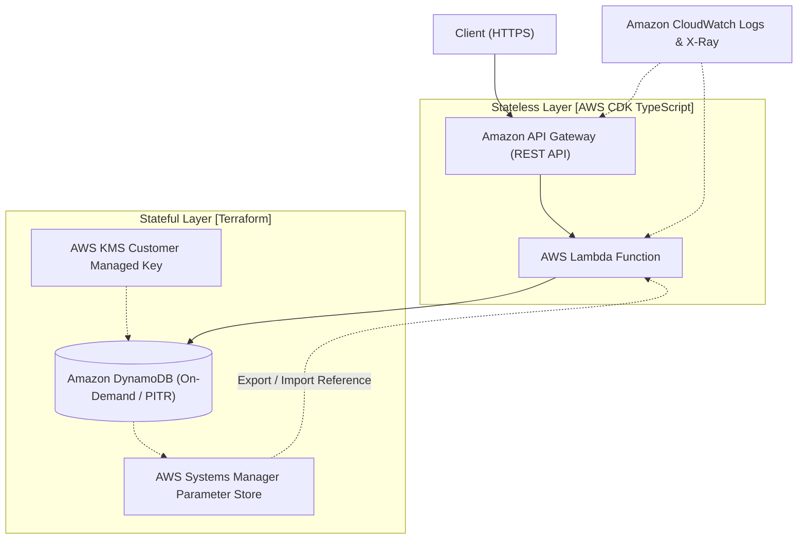

# TerraCDK-Serverless-Stack ⚡️

> **Terraform × AWS CDK 二刀流で切り拓く、本番運用のための完全サーバーレスRESTful API基盤**

---

## 1. プロジェクト概要

本プロジェクトは、現代のクラウドネイティブ開発における最高峰のプラクティスを具現化したサーバーレスRESTful API基盤です。

最大の特徴は、**「ステートフル層（Terraform）」** と **「ステートレス層（AWS CDK）」** のハイブリッド管理（二刀流構成）。
- **Terraform**: 厳密な状態管理と破壊防止（`prevent_destroy`）が求められるDynamoDBや暗号化KMSキー、SSMパラメータを担当。
- **AWS CDK**: アプリケーションコードと密結合し、柔軟な反復開発・型安全なスキーマ変更が求められるAPI GatewayやLambdaを担当。

両レイヤーを **AWS Systems Manager (SSM) Parameter Store** で疎結合に連携させることで、安全運用の極致と爆速開発の自由度を両立させています。

### 💡 主なアーキテクチャ特性
- **オンデマンドスケーリング**: DynamoDB On-DemandとAPI Gateway / Lambdaによる完全従量課金と高スケーラビリティ
- **堅牢なデータ保護**: Point-in-Time Recovery (PITR) 有効化、KMS暗号化、常時TLS 1.2以上の強制
- **徹底した可観測性**: API Gatewayアクセスログ、Lambda構造化ログ（30日保持）、AWS X-Rayによる分散アクティブトレーシング

---

## 2. インフラ構成図 (Architecture)



---

## 3. ディレクトリ構造とデプロイ手順

### 📁 ディレクトリ構造

```text
.
├── terraform/                # [Terraform] ステートフル基盤層
│   ├── envs/
│   │   ├── dev/
│   │   └── prod/
│   ├── modules/
│   │   ├── dynamodb/
│   │   └── ssm/
│   ├── main.tf
│   ├── variables.tf
│   └── outputs.tf            # SSMへのパラメータ書き出し定義
│
└── cdk/                      # [AWS CDK] ステートレスアプリ層
    ├── bin/
    │   └── app.ts
    ├── lib/
    │   ├── api-stack.ts      # API Gateway + Lambda定義
    │   └── config.ts         # SSMから取得した環境変数マッピング
    ├── src/
    │   └── lambda/           # Lambda関数ソースコード
    ├── cdk.json
    ├── package.json
    └── tsconfig.json
```

### 🚀 展開手順 (Deployment Order)

リソース間の依存関係があるため、必ず **Phase 1 (Terraform) -> Phase 2 (CDK)** の順序でプロビジョニングを実行してください。

#### Phase 1: ステートフル層のプロビジョニング (Terraform)
```bash
cd terraform
terraform init
terraform plan
terraform apply -auto-approve
cd ..
```
*※ DynamoDBテーブル名やARNがSSM Parameter Storeに自動出力されます。*

#### Phase 2: ステートレス層のデプロイ (AWS CDK)
```bash
cd cdk
npm install
npm run build
npx cdk synth
npx cdk deploy --require-approval never
cd ..
```
*※ SSM Parameter Store経由で動的に設定を読み込み、API GatewayおよびLambda関数がデプロイされます。*

---

## 4. エンドロール / キャスト

本プロジェクトを創り上げた『AIアプリ工場劇場』のプロフェッショナルたち：

- **要件定義・システム構想**: agent🔵
- **仕様設計・プロトコル策定**: agent🍇
- **IaC高速実装・コード生成**: agent🍊
- **品質保証・自動テスト・検証**: agent🟢
- **総合プロデュース**: agent🟡
